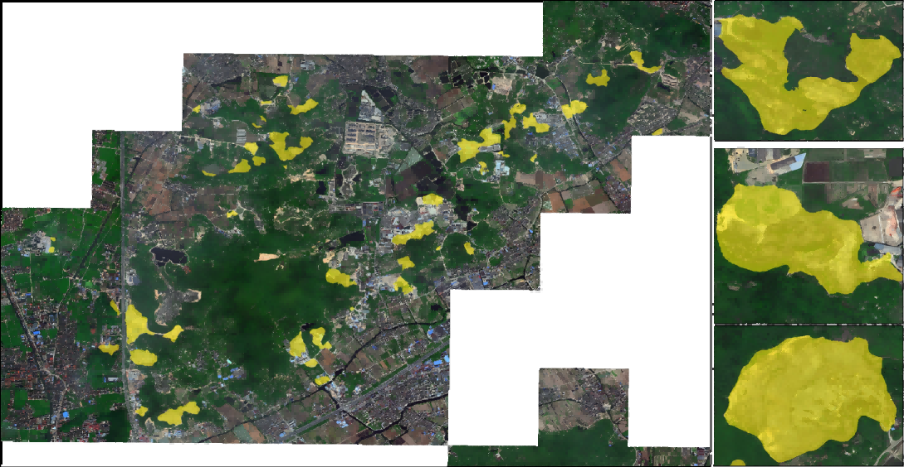

# Height Knowledge-Guided Open-Pit Mine Extraction Network

Official PyTorch implementation of the IEEE GRSL paper:

> **Height Knowledge-Guided Open-Pit Mine Extraction Network for High-Resolution Remote Sensing Imagery**
> *IEEE Geoscience and Remote Sensing Letters, 2026*

---

## 🔍 Visual Results



*Example of open-pit mine extraction results in Ningbo.*

## 📦 Dataset

The dataset used in this work is publicly available at:

👉 https://huggingface.co/datasets/RainY197/Mineset

---

## 🛠️ Environment

The code is implemented in PyTorch and requires minimal dependencies.

### Recommended environment

```bash
torch >= 2.0
timm >= 1.0
```

Example:

```bash
torch==2.0.1
timm==1.0.15
```

---

## 🚀 Getting Started

### 1. Download dataset

Download and extract the dataset from HuggingFace:

```bash
tar -xvf image_v2.tar
tar -xvf annotation_v2.tar
```

Update dataset paths in:

```bash
minedataset.py
```

---

### 2. Training

Run the main training script:

```bash
python train.py
```

* Convnext need to be download mannuly https://dl.fbaipublicfiles.com/convnext/convnext_base_22k_224.pth.
* The script handles dataset loading, model initialization, and training.
* Note: **No validation set is used in the current implementation.**

---

### 3. Evaluation

Compute test metrics:

```bash
python test_metric.py
```

* Trained weight to be download mannuly in release.
  
---

### 4. Large-scale inference

For large remote sensing images:

```bash
python large_test.py
```

---

## 🧠 Method Overview

This work proposes a **height knowledge-guided semantic segmentation network** for open-pit mine extraction from high-resolution remote sensing imagery.

Key characteristics:

* Incorporates **height-related prior knowledge** derived from binary masks
* Enhances semantic segmentation performance for mining areas
* Designed for high-resolution remote sensing scenarios

---

## 📁 Repository Structure

```bash
.
├── train.py              # Main training script
├── minedataset.py        # Dataset loader (includes height label generation)
├── test_metric.py        # Evaluation on test set
├── large_test.py         # Inference on large images
├── frameworks.py         # Training framework definition
├── networks/             # Model architectures (ConvNeXt-based)
├── preweights/           # Pretrained model weights
```

---

## ⚙️ Notes

* Dataset paths must be manually configured in `minedataset.py`.
* Height information is generated dynamically from binary masks.
* The current version focuses on training and testing; further extensions can include validation strategies.

---

## 📖 Citation

If you use this work, please cite:

```bibtex
@ARTICLE{11370143,
  author={Liao, Jia and Yang, Ruoyu and Guo, Qi and Xiao, Kaiyi and Liu, Yinhe},
  journal={IEEE Geoscience and Remote Sensing Letters}, 
  title={Height Knowledge-Guided Open-Pit Mine Extraction Network for High-Resolution Remote Sensing Imagery}, 
  year={2026},
  volume={23},
  pages={1-5},
  doi={10.1109/LGRS.2026.3660189}
}
```

---

## ⚠️ License

This method is developed by the
**Intelligent Remote Sensing Data Extraction and Analysis Group (RSIDEA)**
👉 http://rsidea.whu.edu.cn/

Affiliated with the
**State Key Laboratory of Information Engineering in Surveying, Mapping and Remote Sensing (LIESMARS), Wuhan University**

* The code is **for academic use only**
* **Commercial use is strictly prohibited**

---

## 📬 Contact

For questions or collaborations, please contact the authors or visit the RSIDEA group website.
